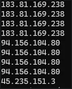

## 📆 Days 11–13: Brute Force Attacks, SSH Logs & Elastic Agent Deployment

## Day 11: Brute Force Attacks and Detection Attempts

### What Is a Brute Force Attack?

A brute force attack is a trial-and-error method used to guess login credentials or encryption keys. Attackers automate this process, trying endless combinations until one works.

It’s repetitive, noisy, and usually easy to detect, if you know what to look for.

### 🧱 Types of Brute Force Attacks

- **Classic Brute Force**: Tries every possible character combination.
- **Dictionary Attack**: Uses a list of common or leaked passwords.
- **Credential Stuffing**: Attempts known username-password pairs on multiple services.
- **Hybrid Attack**: Combines dictionary words with symbols/numbers.

### 🧰 Common Tools

These tools are often used in offensive security, but blue teams also leverage them to test defenses:

- **Hydra**: Supports SSH, FTP, HTTP, and more.
- **Hashcat**: Cracks password hashes using GPUs.
- **John the Ripper**: Combines brute force and dictionary techniques.

### 📌 Key Takeaway

Brute force attacks persist because weak passwords are still common.  
Knowing the attacker’s tools and methods helps defenders design smarter alerts and simulate attacker behavior internally.

---

## 🧾 Day 12: Ubuntu SSH Logs – Real Brute Force Attempts

I deployed a new **Ubuntu Server 24.04** on Vultr and exposed it to the internet to attract activity. After a few hours, I pulled logs using the follwoing command:

```bash
/var/log# grep -i failed auth.log
```


### 🔍Observations

- Repeated failed root login attempts

- Single IP: 183.81.169.238

- Ports rotated frequently (automated/scripted behavior)

## Day 13: Installing Elastic Agent + Centralizing Logs

I installed Elastic Agent on the Ubuntu host to begin sending logs to my Elastic Stack for centralized review in Kibana. Because this is a testing enviroment, I used a self-signed certificate by adding the flag:
```bash
--insecure
```


---

### 🔍 Investigating SSH Failures

I wanted to trace failed login attempts, particularly those targeting the root user. Using the following command on the server, I filtered out IPs involved in failed root login attempts:

```bash
grep -i failed auth.log | grep -i root | cut -d ' ' -f 9
```
Here’s a snippet of what came up:



After observing the IP `183.81.169.238` once again. In Kibana ,I filtered for authentication failure logs and located entries from the same ip:


This confirmed that the Elastic Agent was:

- Forwarding logs correctly

- Capturing real-time brute force activity
