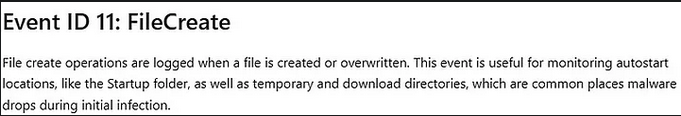

## 📆 Days 6–10: Fleet Server, Elastic Agent, Sysmon & Defender Logging

## Days 6 & 7: Elastic Agent + Fleet Server

### 🔧 What I Set Up:
- **Elastic Agent**: A unified agent for log collection, monitoring, and security policies across endpoints.
- **Fleet Server**: Central management hub for all Elastic Agents, deployed and configured through Kibana’s Fleet UI.

### ⚙️ Troubleshooting:
During setup, I encountered firewall-related issues preventing Fleet Server from reaching Elasticsearch on port 9200.

**Fixes applied:**
1. Modified Vultr firewall rules to allow access to Elasticsearch.  
    <!-- [screenshot] -->
2. Enabled port 9200 on the Ubuntu VM using `ufw`.  
    <!-- [screenshot] -->

✅ After these changes, Fleet Server was successfully enrolled and began managing agents.

> 💡 *Tip:* When I couldn’t SSH into my Ubuntu server, a few VM reboots did the trick. Don’t underestimate the power of a simple restart.

---

## 🔍 Day 8: Introduction to Sysmon

Sysmon adds powerful visibility into host-level activity by logging:

- Process creation
- Network connections
- File modification
- And more...

Sysmon acts like a security camera inside your system — crucial for detection and forensic analysis.

### 📌 Key Insight:
Standard Windows logs don’t give enough detail. Sysmon fills the gaps and captures the "who, what, when, where" of system behavior.

---

## 💻 Day 9: Installing Sysmon

I connected via RDP to the Windows VM and downloaded:
- **Sysmon v15.15** from Microsoft
- **Config file** from Olaf’s GitHub repo

Installation went smoothly using the command line.  
 <!-- [screenshot] -->

### 📋 Event Viewer Validation:
I confirmed that Sysmon was working by viewing logs in Event Viewer.

- **Event ID 11 (FileCreate)** appeared first.  
   <!-- [screenshot] -->
   <!-- [screenshot] -->

---

## 📊 Day 10: Data Ingestion into Elasticsearch

Today was all about getting real log data into Elasticsearch using:

- **Sysmon Integration**: Captures file, process, and network activity
- **Windows Defender Integration**: Captures security alerts (Event IDs 1116, 1117, 5001)

### ✅ Steps:
1. From Kibana, I added both integrations via the **Integrations** tab.
2. Logs began flowing into Elasticsearch after resolving a blocked port (again, port 9200).  
    <!-- [screenshot] -->

### 📈 Sample Logs:
- Defender alert (manually triggered):  
   <!-- [screenshot] -->

- Sysmon logging active:  
   <!-- [screenshot] -->

---

## ✅ Summary

By the end of Day 10:

- Elastic Agent and Fleet Server are fully connected and operational
- Sysmon and Defender are logging critical system activity
- Data is actively being ingested into Elasticsearch for analysis

This phase gave the SOC environment real visibility into host activity. Up next: **log analysis and detection logic** 🔍

